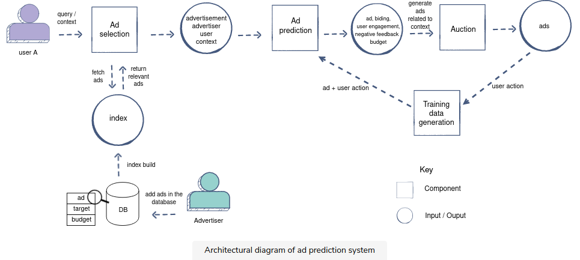

To do:
  1. Phil 的project
  2. curve 分类的拓展： 检测异常filaments? -> intensity: 每张图片normalize
  3. adaboost ; gbdt
  4. dataset scale, how much you needed, 
  5. 训练时间， 训练技巧
  6. Cold start problem
  7. attention mechanism
  8. transformer
  9. Representation learning/contrastive loss
  10. 各个模型区别
  11. 系统对可解释性的要求
  12. 情感分析
  13. https://towardsdatascience.com/deep-surveillance-6b389abeaf95
  14. 
  
植物前期病变
========
1. 植物 细菌感染
Goal：

      1.cotrol/test -> 量化他们的结构的变化，filamentous structure 的长度，数量， 等等
      2. anomaly detection: 检测 filament 的亮度 和 长度; tracking
      3. clustering; two ways: 
          1. curve clustering fit curve
          2. gaussian mixture model get the area; and cauclate percentage per cell
          
      2. length, intensity; curvature:number of extremae cruvure points (larger than certain threshold); orientation anlge. 
     
      3. 量化分析,如何描述他们的变化？ clustering; filament， bag of word; 分类; cosine simliarty
    
      5. 那现在我们在做的就是 如何描述pattern 的变化
      6. evaluation: 合成图像
      
      
The pattern of cells filamentous structures will change

广告安全：
=========
GOOGLE pedphile 事件

不适信息检测：推送合适广告
  1. post -> feature
  2. 高端品盘和马桶放一起等等

危险信息检测/负面信息检测;

1. 不适信息检测
  Problem statement
  Metrics:
  

  
正常广告推送：
  
  1. Ad selection: The ad selection component will fetch the top k ads based on relevance (subject to the user context) and bid from the ads index.
  2. Ad prediction The ad prediction component will predict user engagement with the ad (the probability that an action will be taken on the ad if it is shown), given the ad, advertiser, user, and context. Then, it will rank ads based on relevance score and bid.
  3. Ads auction 
  
  Feature Engineering:
  
    1. Ad specific features

    2. Advertiser specific features

    3. User specific features
      age,年龄，国家，性别，使用时间，historgram 等等各种过去频率统计

    4. Context specific features
      season_of_the_year；upcoming_holiday；days_to_upcoming_holiday

    7. User-ad cross features

    6. User-advertiser cross features
  
  Ad selection:
    
    So, the above selection criteria in phase 1 will reduce our space set from all active ads to ads that are targeted for the current user.

  
  
其他
=========
  
* Adaboost:
  * AdaBoost会提高前一轮被弱（基）分类器误分的样本的权重，降低那些被正确分类得样本的权值。这样就会让被误分的样本在下一轮中被弱分类器更加关注（因为误分的样本权重大)
  
  * AdaBoost采取加权投票的原则，即加大分类误差率小的弱分类器的权重，使其在表决中起较大的作用，减小分类误差率大的弱分类器的权重，使其在表决中起较小的作用
  
三，随机森林和GBDT的区别：

    随机森林采用的bagging思想，而GBDT采用的boosting思想。这两种方法都是Bootstrap思想的应用，Bootstrap是一种有放回的抽样方法思想。虽然都是有放回的抽样，但二者的区别在于：Bagging采用有放回的均匀取样，而Boosting根据错误率来取样（Boosting初始化时对每一个训练样例赋相等的权重1／n，然后用该算法对训练集训练t轮，每次训练后，对训练失败的样例赋以较大的权重），因此Boosting的分类精度要优于Bagging。Bagging的训练集的选择是随机的，各训练集之间相互独立，弱分类器可并行，而Boosting的训练集的选择与前一轮的学习结果有关，是串行的。
    组成随机森林的树可以是分类树，也可以是回归树；而GBDT只能由回归树组成。
    组成随机森林的树可以并行生成；而GBDT只能是串行生成。
    对于最终的输出结果而言，随机森林采用多数投票等；而GBDT则是将所有结果累加起来，或者加权累加起来。
    随机森林对异常值不敏感；GBDT对异常值非常敏感。
    随机森林对训练集一视同仁；GBDT是基于权值的弱分类器的集成。
    随机森林是通过减少模型方差提高性能；GBDT是通过减少模型偏差提高性能。
    
* Complexities consideration for an ML system (Requirement)

  * Compare between: Multiple Additive Regression Trees (MART)/ Gradient boosting decision tree(GBDT); Neural Network; Linear/Logistic Regression (Batch) 
  * Training complexity
  * Evaluation complexity
  * Sample complexity
  * Funnel approach for an ad prediction system (Logistic regression -> neural network / GBDT)
  
* Data

  Data collection
  
  * Online data collection through a user's interaction with the system in place
  * Human labelers (offline)
  
   * Crowdsourcing
   * Specialized labelers
   * Open-source dataset
   * Build the product in a way that it collects data from users
   * Creative manual expansion (data augmentation)
   * Data expansion using GANs (For image translation)
    
  
  Train, test, & validation splits
  
  Cleaning up data:
    * missing data
    
    * Unblanced data
    
    * outliers
    * duplicates
    * dropping out irrelevant features
    
    * Removing bias
    * Bootstrapping new items
    
  Embeddings
    TEXT:
    * word2vec 
        Self-supervised learning from a large corpus of text data
     * CBOW (continuous bag of words)
        predict the current word from its surrounding words
        Loss = -log (p(wt| wt-n ......wt+n)
     * Skipgram: 
        predict surrounding words from the current word
    
    * Embedding from language models(ELMo)
    * BERT
    * GPT
      
    Visual:
    * Auto-encoders
    * pre-trained model as our image embedding.
    
  
